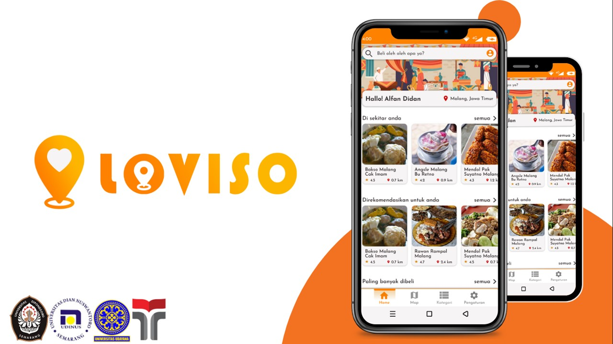
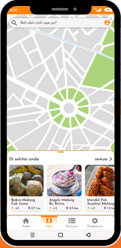
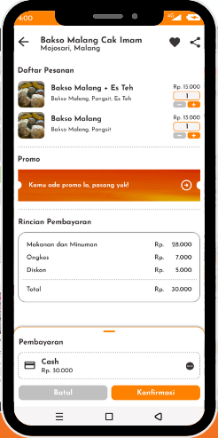

# Loviso
Capstone Project C23-PS126

## Overview
Loviso (Location Advisor) is a mobile application designed to increase MSMEs and regional commodities  
We plan to introduce MSME products and regional commodities that have not been published optimally to help the regional economy and prepare society for the industrial revolution 4.0

## Project Team Member
● (ML) M166DSX1823 – Muhamad Faishal Ramadhan – Universitas Diponegoro  
● (ML) M166DSY1268 – Evrilsa Isna Pangastuti – Universitas Diponegoro  
● (ML) M166DSX2304 – Ageng Windarto Jati – Universitas Diponegoro  
● (CC) C163DSX2393 – Yudha Bayu Prastyo – Universitas Dian Nuswantoro  
● (CC) C368DSX3062 – I Nyoman Natha Pratama – Universitas Udayana  
● (MD) A042DSX3463 – Alfan Didan Septiandri Argandi – Institut Teknologi Telkom Purwokerto  

## Features
● Recommendations  

● Maps  

● Market  

## Dataset for Deployment  
Link Places_Dataset:  
https://docs.google.com/spreadsheets/d/1uNjtGcBoy4QIqnhTThsB1jPxOTH-ioQf/edit#gid=1357539679  
Link Users_Dataset:  
https://docs.google.com/spreadsheets/d/1Btsjnc3O3EWWElGuYWg633htufJCwORf/edit#gid=849637914  

## Tools
● Android: Figma, Maze, Android Studio, Postman  
● Machine Learning: PyCharm  
● Cloud Computing: Google CLoud Platform (GCP), Firebase, Postman  

## Library
● Android: Google Android GMS, Google Android Material, AndroidX, Squareup Retrofit2  
● Machine Learning: Flask, gunicorn, tensorflow, joblib, pandas, numpy, scikit-learn, h5py, openpyxl  

## Deployed App
Link Deploy API Loviso (Flask): https://apiloviso-n2pk7zaj5a-et.a.run.app/  
● End Point 1 (POST): https://apiloviso-n2pk7zaj5a-et.a.run.app/locations  
● End Point 2 (POST): https://apiloviso-n2pk7zaj5a-et.a.run.app/collaborative  

## API Documentation
Flask API: https://documenter.getpostman.com/view/28023494/2s93shyUnx 

## Deploy to Google Cloud Platform
The deployment of our Flask App is documented [here](loviso-deployment.md)
