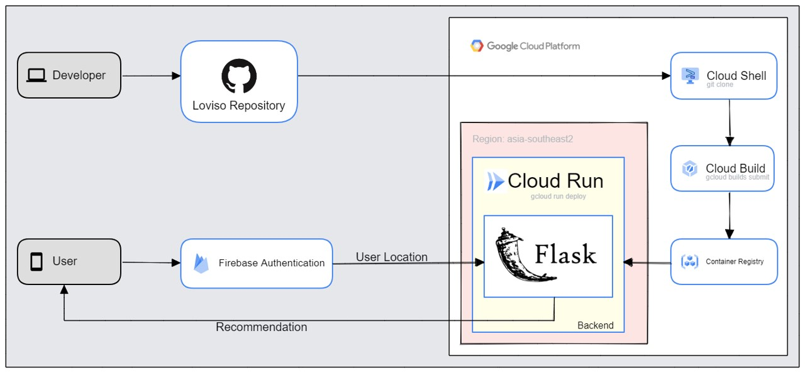

# Loviso Deployment in GCP

## Cloud Architecture


## Step 1: Activate the API for both Cloud Build and Cloud Run 
```bash
gcloud services enable \
    containerregistry.googleapis.com \
    run.googleapis.com \
```

## Step 2: Clone The Repository then Move to Folder 'Deployment Loviso'
```bash
git clone https://github.com/MFaishalRamadhan/Capstone.git
```
```bash
cd 'Deployment Loviso'
```
## Step 3: 
```bash
gcloud builds submit --tag gcr.io/latihan-deploy-ml-loviso/get_recommendations
```

## Step 4: Deploy to Cloud Run
```bash
gcloud run deploy --image gcr.io/latihan-deploy-ml-loviso/get_recommendations --platform managed
```
